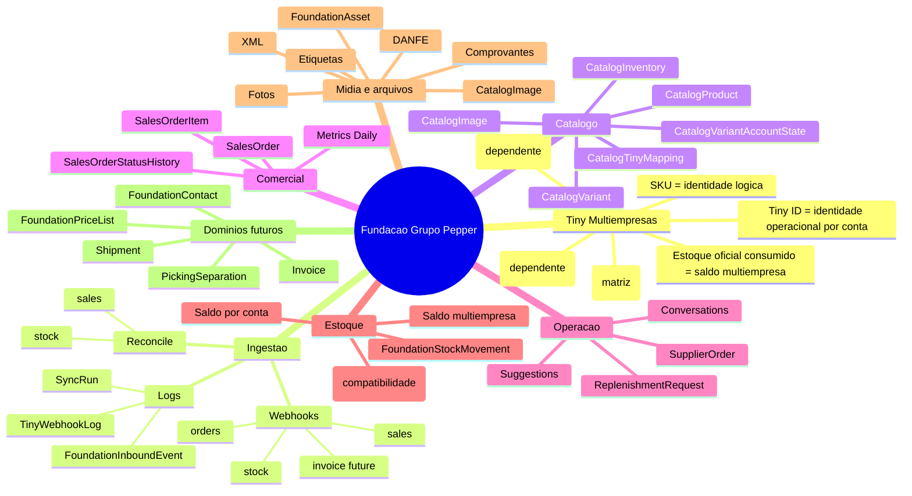
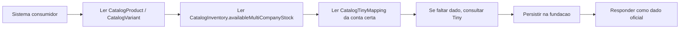
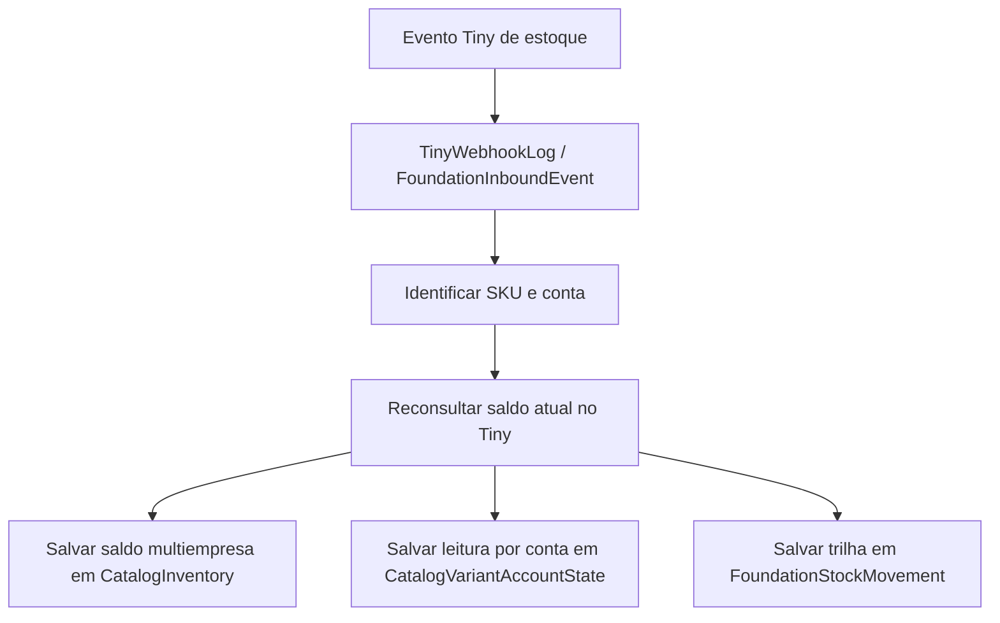

# Mapa Mental da Fundacao Grupo Pepper

Data base: 2026-04-16

## Visao mental da fundacao

## Fluxo oficial de leitura

## Fluxo oficial de estoque multiempresa

## Fluxo oficial para futuros sistemas

1. identificar o dominio certo
2. consumir a fundacao antes de abrir nova tabela
3. usar `SKU` como chave entre sistemas
4. usar `Tiny ID` so dentro da chamada operacional da conta
5. persistir tudo de volta na fundacao

## Regras de bolso

- `Pepper` e matriz de governanca
- `Show Look` e `On Shop` sao dependentes, mas tambem afetam o saldo compartilhado
- o saldo oficial do portal e sempre o `saldo multiempresa`
- webhook e sinal, nao verdade final sem reconciliacao
- fotos e documentos devem ficar em dominio oficial de midia
- sistema novo nao cria lista paralela se a fundacao ja tiver um dominio para aquilo
